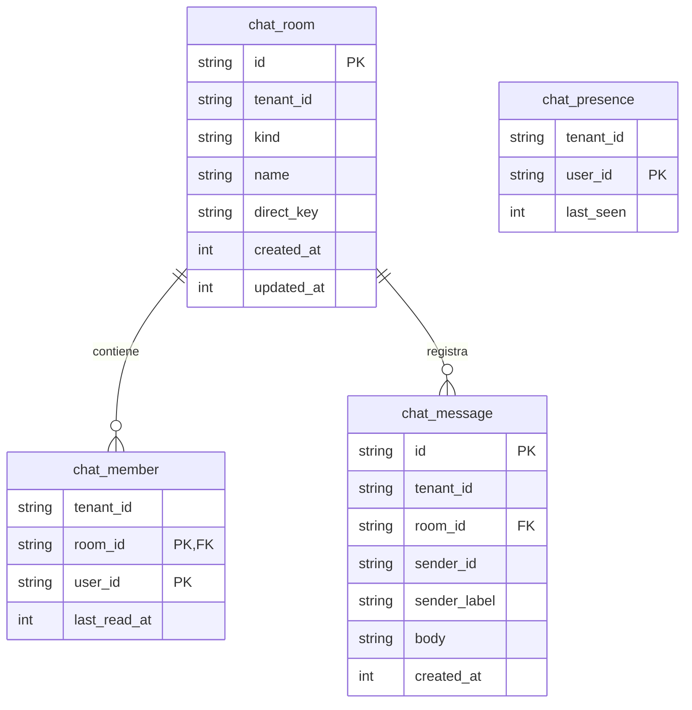

# Diagrama de Base de Datos — Módulo `chat_room`

```mermaid
erDiagram
    chat_room {
        string id PK
        string tenant_id
        string kind
        string name
        string direct_key
        int created_at
        int updated_at
    }

    chat_member {
        string tenant_id
        string room_id PK, FK
        string user_id PK
        int last_read_at
    }

    chat_message {
        string id PK
        string tenant_id
        string room_id FK
        string sender_id
        string sender_label
        string body
        int created_at
    }

    chat_presence {
        string tenant_id
        string user_id PK
        int last_seen
    }

    chat_room ||--o{ chat_member : "contiene"
    chat_room ||--o{ chat_message : "registra"
```
